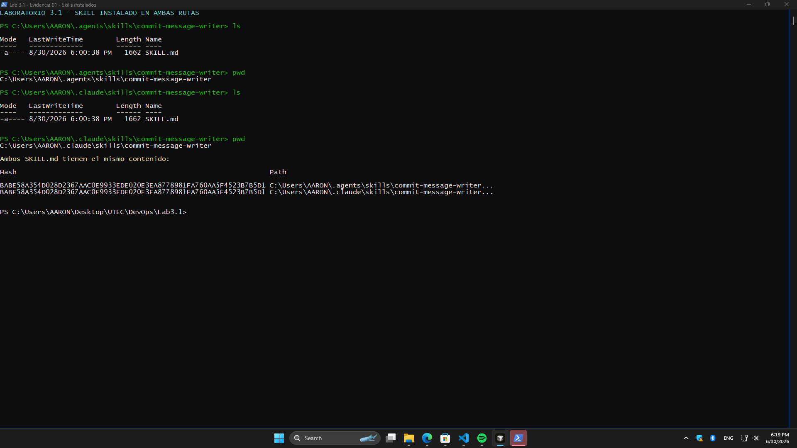
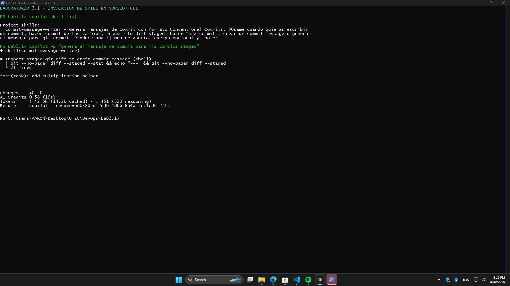
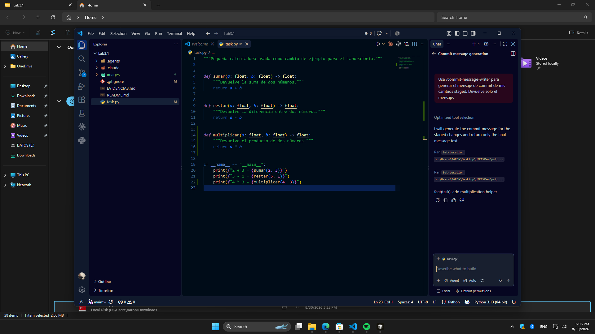
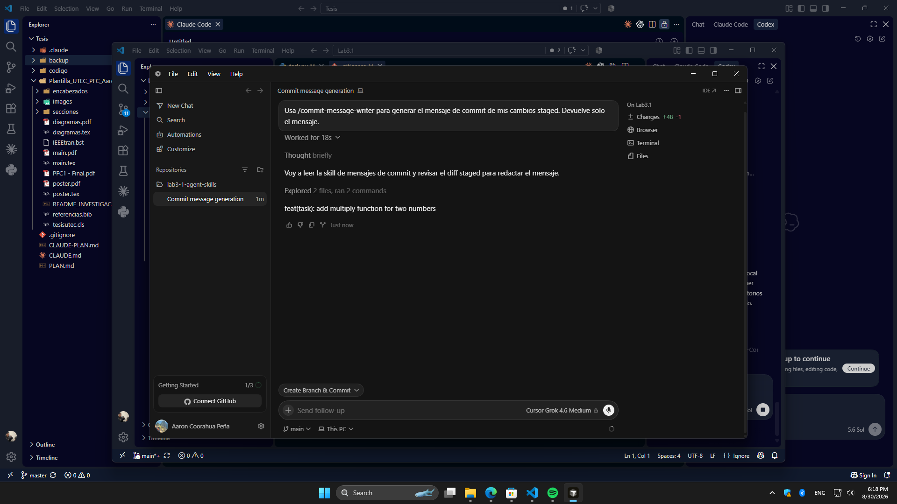
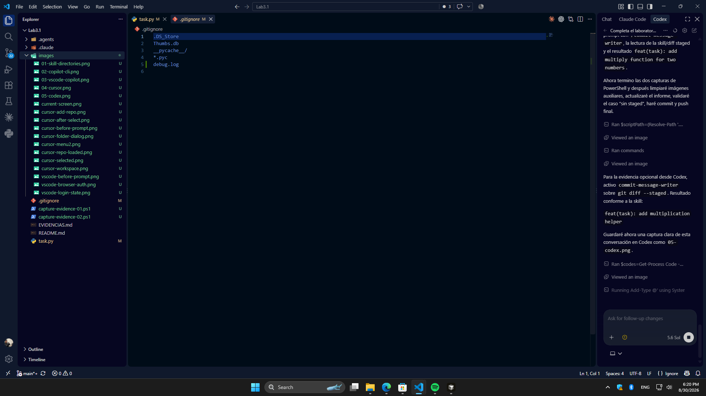

# Evidencias del laboratorio

Las imágenes listas para pegar están en `images/`, numeradas en el mismo orden
del documento de entregables. El repositorio entregable es:

<https://github.com/AaronCoorahua/lab3-1-agent-skills>

| Entregable | Archivo | Estado |
|---|---|---|
| Skill en `~/.agents/skills` y `~/.claude/skills` | `images/01-skill-directories.png` | Completado |
| Skill invocado desde Copilot CLI | `images/02-copilot-cli.png` | Completado |
| Skill invocado desde VS Code + Copilot Chat | `images/03-vscode-copilot.png` | Completado |
| Skill invocado desde Cursor | `images/04-cursor.png` | Completado |
| Skill invocado desde Gemini CLI (opcional) | — | No realizado: opcional |
| Skill invocado desde Codex (opcional) | `images/05-codex.png` | Completado |
| Skill invocado desde Antigravity (opcional) | — | No realizado: opcional |

## Capturas listas para entregar

### 1. Directorios globales de Agent Skills y Claude Code

### 2. Invocación desde Copilot CLI

### 3. Invocación desde Visual Studio Code con GitHub Copilot

### 4. Invocación desde Cursor

### 5. Invocación desde Codex (opcional)

## Validaciones solicitadas

- Invocación directa: `/commit-message-writer`.
- Lenguaje natural: `genera el mensaje de commit para mis cambios staged`.
- Sin cambios staged: debe indicar que no hay cambios staged.
- Cambios no relacionados: debe proponer mensajes separados por tipo.

Los pasos opcionales no son necesarios para completar los entregables
obligatorios. No se instaló Gemini CLI ni Antigravity.

## Herramientas verificadas

- GitHub Copilot CLI 1.0.82.
- Visual Studio Code 1.135.0 con GitHub Copilot Chat integrado.
- Cursor 3.18.9.
- Skill validado con `quick_validate.py` en las rutas de proyecto.
